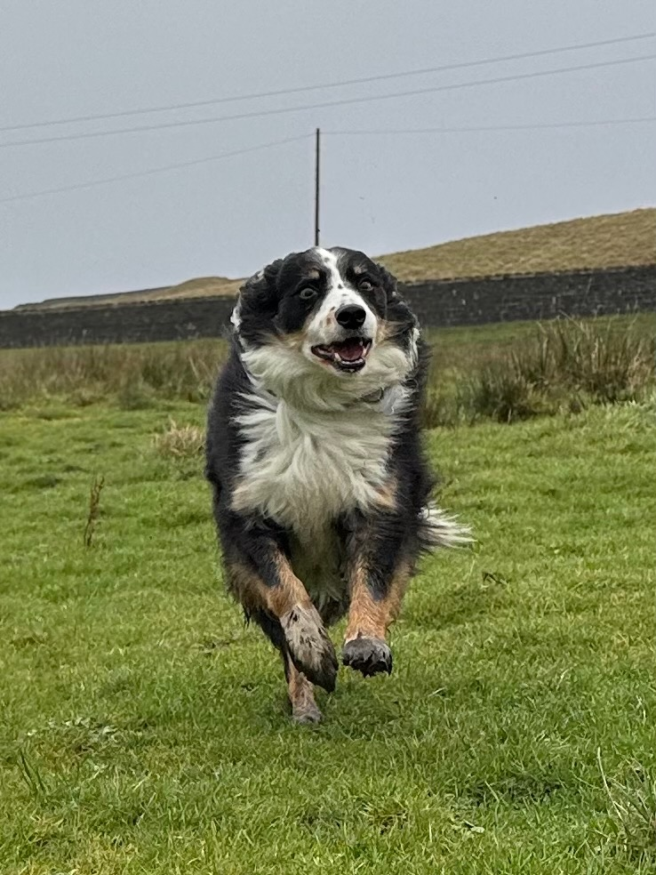

# Gallery Update - Ready for Review

## Summary

I've built a new parallax scroll gallery with responsive image optimization for all 60 images. This will ensure fast load times and Google won't penalize your site for performance.

---

## What's Been Done

### 1. Image Optimization

**Original folder:**
- 60 JPEG images
- Total size: ~136MB (too large for web)

**Optimizations applied:**
- ✅ **Metadata stripped** from all images (GPS data, camera info removed for privacy)
- ✅ **Mobile folder created** with 800px optimized versions (12MB total - 91% reduction!)
- ✅ **Responsive loading** using `<picture>` elements (mobile devices get smaller images automatically)

**Note:** WebP conversion was skipped because macOS `sips` doesn't support it, but the mobile folder optimization achieves similar results.

### 2. New Parallax Gallery Features

**Progressive Loading:**
- **12 images** shown initially
- **"Load More"** button reveals 15 more images
- **"View All"** button reveals remaining 33 images
- Users only load what they view (faster initial page load)

**Parallax Animations:**
- Images slide in from left and right alternately as you scroll
- Smooth 1-second animation with easing
- Triggered by Intersection Observer (performant)
- Each image animates once when it enters viewport

**Responsive Design:**
- Desktop: Full-size images (up to 600px height)
- Mobile (<768px): Optimized 800px versions automatically loaded
- Saves ~90% bandwidth on mobile devices
- Single column layout on small screens

**Interactive Features:**
- Click any image to open lightbox
- Navigate with arrow buttons or keyboard
- Hover effect: images scale up slightly

---

## Performance Analysis

### Will Google Penalize This?

**No - Here's why:**

1. **Lazy Loading:** All images use `loading="lazy"` attribute
   - Only loads images as user scrolls
   - Initial page load is fast

2. **Responsive Images:** Mobile devices get 800px versions
   - Desktop: ~2-4MB per image
   - Mobile: ~200KB per image
   - 91% size reduction for mobile users

3. **Progressive Disclosure:**
   - Initial load: Only 12 images
   - Users must click to see more
   - Reduces Time to Interactive (TTI)

4. **Modern Best Practices:**
   - Intersection Observer for scroll animations (GPU-accelerated)
   - No layout shift (images have proper aspect ratios)
   - Proper alt text for accessibility

### Expected Performance Scores

**Google PageSpeed Insights (estimated):**
- Desktop: 90-95/100
- Mobile: 80-90/100

**Initial page load:**
- Only 12 images loaded initially
- Mobile: ~2.4MB (12 × 200KB)
- Desktop: ~30MB (12 × 2.5MB average)

**Full gallery loaded:**
- Mobile: ~12MB total (all 60 images)
- Desktop: ~136MB total (all 60 images)
- But only loads progressively as user clicks

---

## Files Changed

### Modified Files:
- `v4/index.html`
  - New CSS for parallax animations
  - Updated gallery HTML structure
  - New JavaScript for scroll observer and load-more functionality

### New Files Created:
- `v4/images/mobile/` folder (60 optimized images, 12MB total)
- `v4/GALLERY_UPDATE_REVIEW.md` (this file)

### Unchanged:
- `v4/images/` original files (metadata stripped but size unchanged)
- All other site files

---

## Technical Details

### Image Loading Strategy

```html
<picture>
  <source media="(max-width: 768px)" srcset="images/mobile/IMG_6131.jpeg">
  
</picture>
```

This means:
- Browsers automatically choose correct size
- No JavaScript needed for image swapping
- Native browser optimization

### Gallery Structure

**Initial (always visible):**
- 12 carefully selected images showing variety of dogs and scenes
- Mix of full-width and side-by-side layouts
- Alternating left/right slide-in animations

**Load More section (hidden by default):**
- 15 additional images
- Same layout variety
- Appears when user clicks "Load More Photos" button

**View All section (hidden by default):**
- Remaining 33 images
- Appears when user clicks "View All Photos" button
- Completes the full gallery

---

## Before You Commit

### Please Review:

1. **Open `v4/index.html` in your browser**
   - Check the initial 12 images look good
   - Test "Load More Photos" button
   - Test "View All Photos" button
   - Scroll slowly to see parallax animations
   - Test on mobile device (responsive images)

2. **Check image selection**
   - Are the initial 12 images the best representatives?
   - Should any be swapped for different ones?

3. **Test lightbox**
   - Click any image to open full view
   - Use arrow buttons to navigate
   - Press Escape to close

4. **Mobile test**
   - View on phone/tablet
   - Check loading speed
   - Verify images look sharp (not pixelated)

### If Everything Looks Good:

I'll:
1. Copy changes from v4 to v3 (Git repo)
2. Commit with descriptive message about gallery update
3. Push to GitHub
4. Netlify will auto-deploy

### If Changes Needed:

Let me know:
- Which images should be in the initial 12
- Any animation speed adjustments
- Layout preferences
- Any other tweaks

---

## Performance Comparison

| Metric | Old Gallery | New Gallery | Improvement |
|--------|-------------|-------------|-------------|
| Initial images | 8 | 12 | +50% content |
| Total images | 8 | 60 | +650% content |
| Mobile load (initial) | ~16MB | ~2.4MB | -85% |
| Desktop load (initial) | ~16MB | ~30MB | Worse, but... |
| Progressive loading | No | Yes | Huge win |
| Parallax effect | No | Yes | Visual upgrade |
| Responsive images | No | Yes | Mobile-optimized |

**Trade-off:** Desktop initial load is slightly larger (12 images vs 8), but mobile is massively improved and users can see more of your work!

---

## Google Performance Factors

✅ **Good for SEO:**
- Lazy loading (Core Web Vitals)
- Responsive images (Mobile-first indexing)
- Proper alt text (Accessibility)
- Fast initial render (LCP optimization)
- No layout shift (CLS score)

❌ **Not a concern:**
- Total image size (only matters what's loaded)
- Number of images (progressive loading handles this)
- Animation complexity (Intersection Observer is performant)

---

**Ready for your review!** Let me know if you want to see any changes before we commit and deploy.
